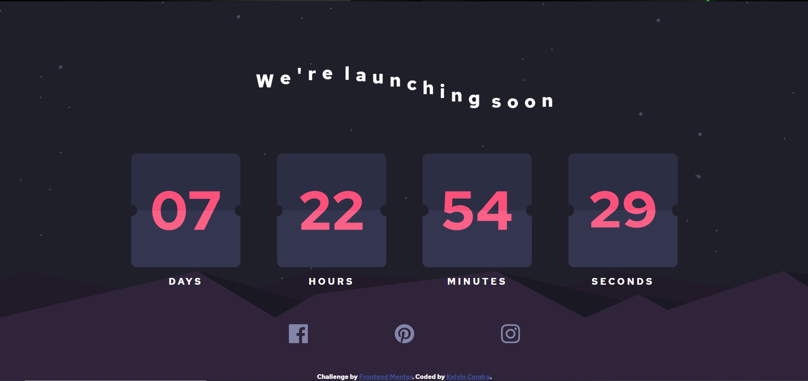

# Frontend Mentor - Launch countdown timer solution

This is a solution to the [Launch countdown timer challenge on Frontend Mentor](https://www.frontendmentor.io/challenges/launch-countdown-timer-N0XkGfyz-). Frontend Mentor challenges help you improve your coding skills by building realistic projects. 

## Table of contents

- [Overview](#overview)
  - [The challenge](#the-challenge)
  - [Screenshot](#screenshot)
  - [Links](#links)
- [My process](#my-process)
  - [Built with](#built-with)
  - [What I learned](#what-i-learned)
  - [Continued development](#continued-development)
  - [Useful resources](#useful-resources)
- [Author](#author)
- [Acknowledgments](#acknowledgments)

## Overview

### The challenge

Users should be able to:

- See hover states for all interactive elements on the page
- See a live countdown timer that ticks down every second (start the count at 14 days)
- **Bonus**: When a number changes, make the card flip from the middle

### Screenshot

### Links

- Solution URL: [My solution](https://github.com/Caprice123/countdown-timer-frontendmentor)
- Live Site URL: [My live sive URL](https://your-live-site-url.comhttps://caprice123.github.io/countdown-timer-frontendmentor/)

## My process

### Built with

- HTML
- CSS
- Javascript

### What I learned

In this Project, I learn how to make animation and make something flip in a certain period of time. I did this by using some css tricks and js codes.

This is my code to tackle that problem

'''css
.flip-top{
    animation                   : flip-top-part 1s forwards;
}

@keyframes flip-top-part{
    0% {
        z-index                 : 5;
        transform               : rotateX(0deg);
    }
    50%{
        z-index                 : 5;
        transform               : rotateX(90deg);
    }
    100%{
        z-index                 : 5;
        transform               : rotateX(90deg);
    }
}
'''

'''js
setInterval(flip_card_sec, 1000);
'''

### Continued development

I would try to learn more about js tricks and running some function in a period of time.

### Useful resources

- [Card Flip](https://www.example.comhttps://www.youtube.com/watch?v=U2GrZAn0S-s&t=105s) - This helps me because this video gives me some idea about the back side of the card that i didn't think about.

**Note: Delete this note and replace the list above with resources that helped you during the challenge. These could come in handy for anyone viewing your solution or for yourself when you look back on this project in the future.**

## Author

- Website - [Kelvin Cendra](https://github.com/Caprice123/countdown-timer-frontendmentor)
- Frontend Mentor - [@Caprice123](https://www.frontendmentor.io/profile/Caprice123)

